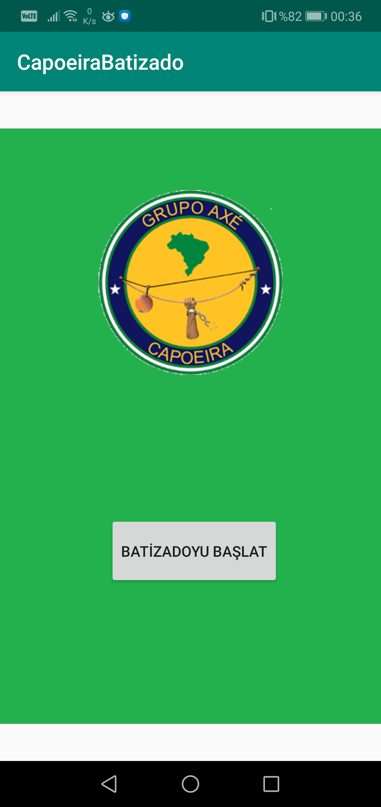
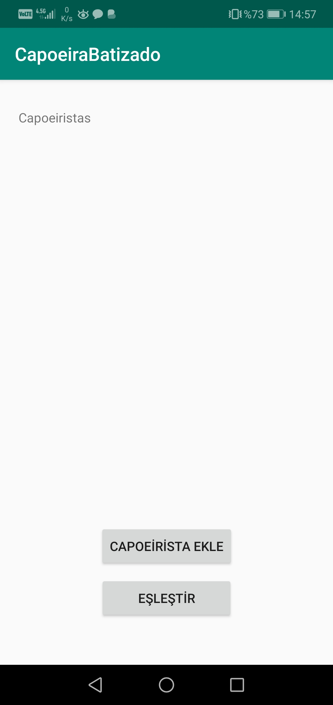
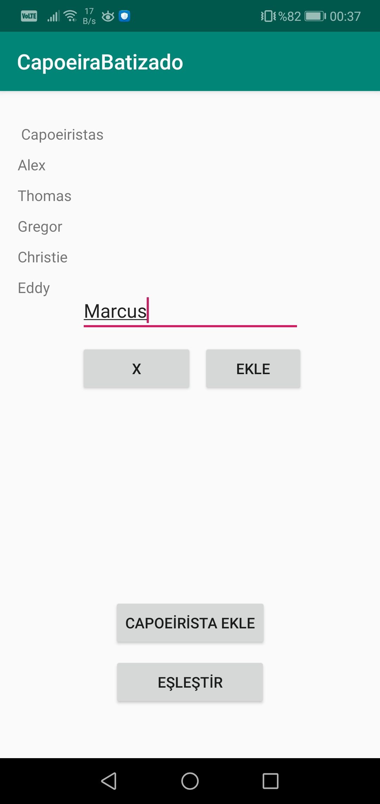
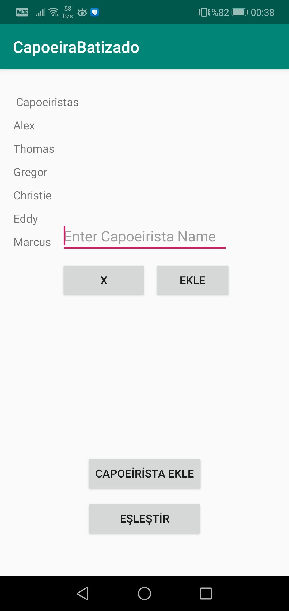
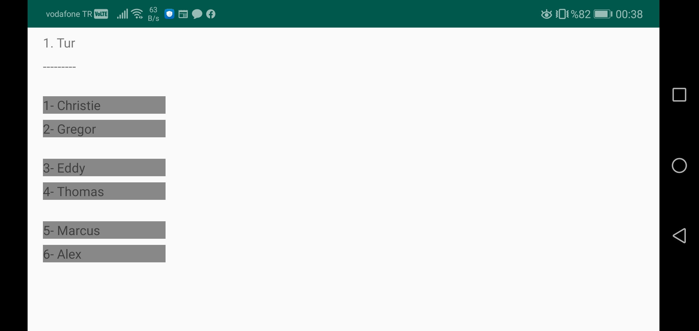
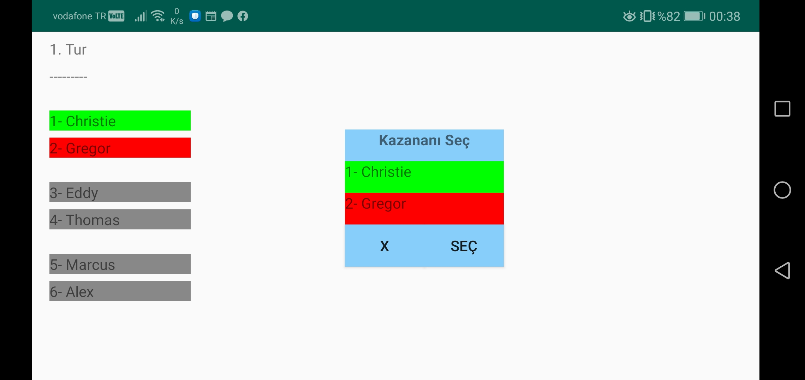
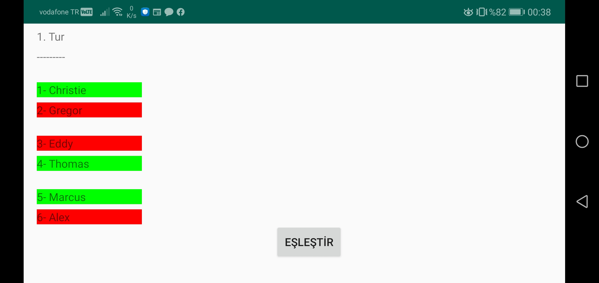
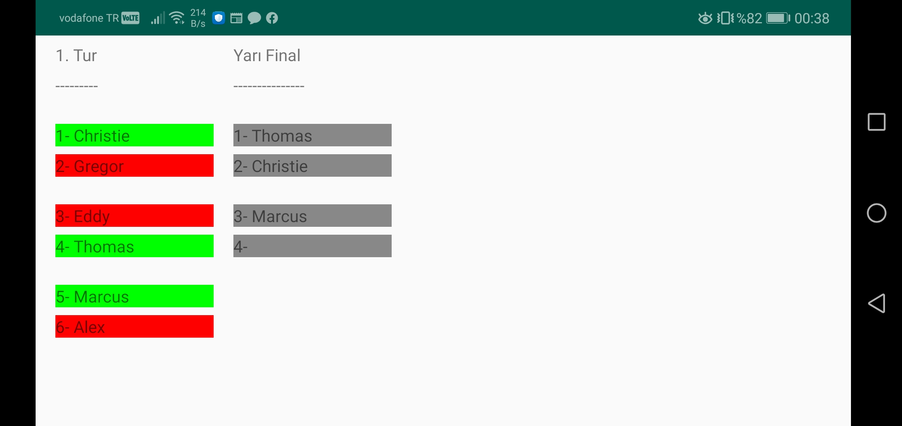
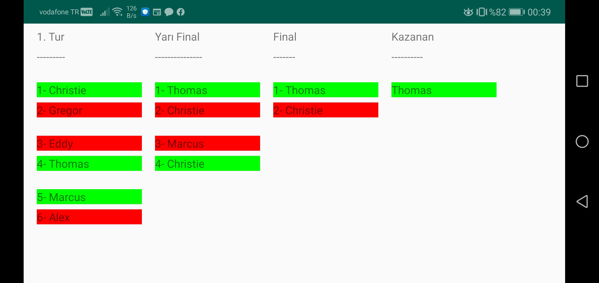

# TournamentMaker

This application was created to make 2-sportsman matchings between participants in a tournament of a sport called Capoeira. The matchings
are formed randomly. If there is odd-numbered participants, the last group has 1 empty seat until previous groups does their match. Between
the losers on the previous matches, randomly, one of them is selected and have another chance to fight. This person gets placed on the
last empty seat. The matchings continue until there is one winner. The language of the application is Turkish.

# Main screen

# Adding participants' names to the tournament

# Tournament

